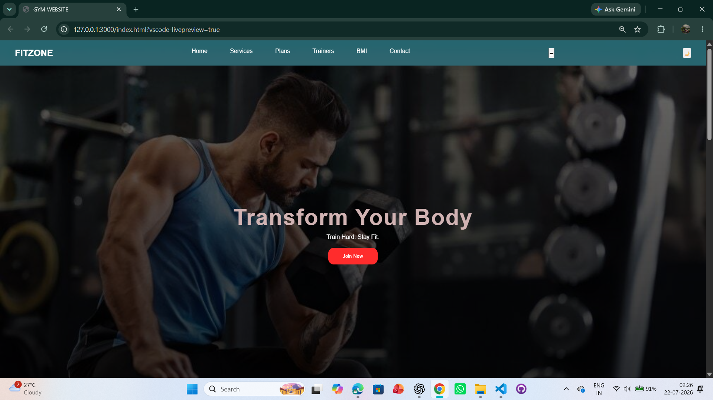

# 🏋️ FitZone Gym Website

A modern and responsive **Gym & Fitness Landing Page** built using **HTML5**, **CSS3**, and **JavaScript**. The website features a clean user interface, responsive navigation, membership plans, trainer showcase, testimonials, a BMI calculator, dark/light mode, and a contact form.

---

## 📸 Preview

> .

Example:

```
images/preview.png
```

---

## ✨ Features

- 🏋️ Modern Hero Section
- 📱 Responsive Navigation Menu
- 🌙 Dark / Light Mode Toggle
- 💪 Gym Services Section
- 💰 Membership Plans
- 👨‍🏫 Professional Trainers Section
- 💬 Customer Testimonials
- ⚖️ BMI Calculator
- 📩 Contact Form
- 📋 Form Submission Alert
- 🎨 Smooth Hover Effects
- 📱 Responsive Design

---

## 🛠️ Technologies Used

- HTML5
- CSS3
- JavaScript (ES6)

---

## 📂 Folder Structure

```text
fitzone-gym-website/
│
├── images/
│   ├── hero.jpg
│   ├── testimonial.jpg
│   ├── trainers.jpg
│   ├── trainers1.jpg
│   └── ...
│
├── index.html
├── style.css
├── script.js
├── README.md
```

---

## 🚀 Getting Started

### 1. Clone the repository

```bash
git clone https://github.com/dibeyendu-dev/fitzone-gym-website.git
```

### 2. Open the project folder

```bash
cd fitzone-gym-website
```

### 3. Run the project

Open the **index.html** file in your preferred web browser.

No installation or external libraries are required.

---

## 📑 Website Sections

- 🏠 Hero
- 💪 Services
- 💰 Membership Plans
- 👨‍🏫 Trainers
- 💬 Testimonials
- ⚖️ BMI Calculator
- 📩 Contact Form
- 📄 Footer

---

## 💡 JavaScript Features

- ✅ Mobile Navigation Menu Toggle
- ✅ Dark / Light Theme Toggle
- ✅ BMI Calculator
- ✅ Contact Form Submission Alert

---

## 📱 Responsive Design

Optimized for:

- 💻 Desktop
- 💼 Laptop
- 📱 Tablet
- 📲 Mobile

---

## 🎨 UI Highlights

- Glassmorphism Navbar
- Gradient Hero Banner
- Hover Animations
- Interactive Cards
- Smooth Theme Switching
- Modern Color Scheme
- Clean Typography

---

## 🔮 Future Improvements

- Login & Registration Page
- Membership Registration
- Trainer Profile Page
- Workout Schedule
- Animated Statistics
- Contact Form Validation
- Backend Integration
- Online Membership Booking

---

## 👨‍💻 Author

**Dibeyendu Maity**

GitHub: https://github.com/dibeyendu-dev

---

## 📄 License

This project is licensed under the **MIT License**.

---

## ⭐ Show Your Support

If you found this project helpful, please give it a **⭐ Star** on GitHub.

---

## 📌 Disclaimer

This project is created for **educational and portfolio purposes only**.